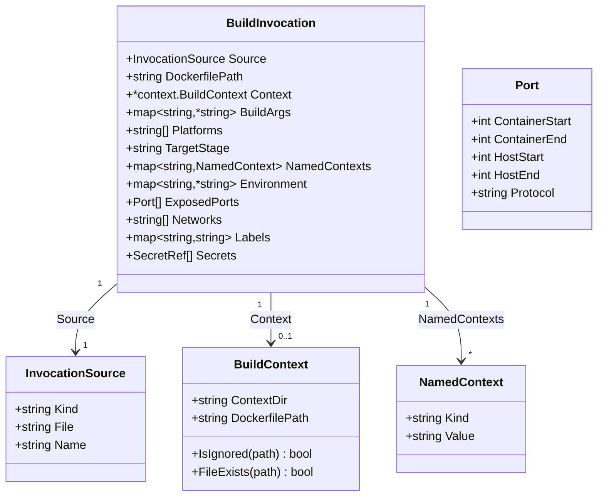
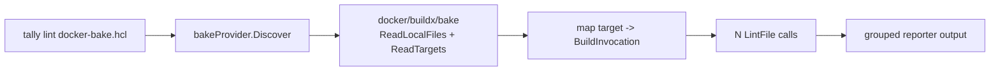
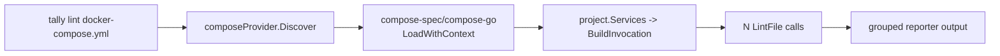
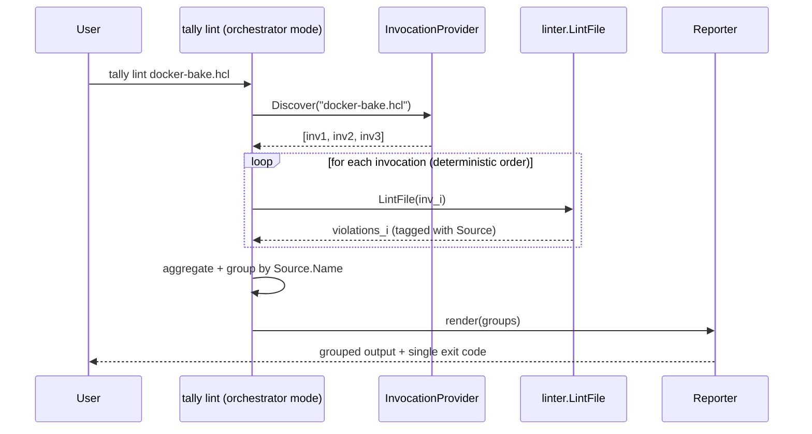
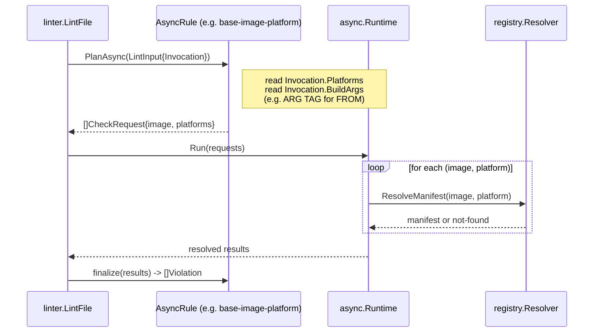

# BuildInvocation Model and Docker Bake / Compose Integration

**Research Focus:** Give tally a first-class representation of *how* a Dockerfile is actually built (build args, target stage, platforms, named
build contexts, exposed ports, env vars, etc.) by consuming Docker Bake and Docker Compose files as new lint entrypoints, so rules can reason about
build-time context that is not present in the Dockerfile text alone.

**Status:** Research — not an implementation request. See
[issue #327](https://github.com/wharflab/tally/issues/327).

**Related design docs:**

- [02 — Docker Buildx Bake `--check` Analysis](02-buildx-bake-check-analysis.md)
- [07 — Context-Aware Linting Foundation](07-context-aware-foundation.md)

---

## Problem

Some of tally's advanced rules increasingly depend on build-time context that is not representable in a single Dockerfile:

- build args (`--build-arg`)
- selected target stage (`--target`)
- selected platform(s) (`--platform`)
- named build contexts (`--build-context name=...`)
- multiple build context directories (one per service)
- service-level metadata: exposed ports, env vars, secrets, networks, labels

Today tally has a filesystem-oriented build context in [`internal/context/context.go`](../internal/context/context.go)
(`.dockerignore` parsing, file existence checks). It does not have a first-class concept of the **invocation context** — the actual set of
flags and orchestrator-level metadata a real build would use.

A naive model — asking the user to restate `--build-arg`, `--platform`, `--target` on the tally CLI — is weak:

- users already declare these in Bake HCL or Compose YAML
- duplicating them on the tally CLI creates drift
- results become untrustworthy as soon as the two sources disagree

Real projects already define builds declaratively. tally should read those declarations directly.

---

## Scope

**In scope:**

- A `BuildInvocation` data model that captures everything a rule might want to know about a planned build.
- `tally lint <path>` accepting **orchestrator files as new entrypoints** — Docker Bake HCL and Docker Compose YAML — on equal footing with plain
  Dockerfiles. Content-sniffing dispatches to the right mode.
- Using upstream libraries (`github.com/docker/buildx/bake`, `github.com/compose-spec/compose-go/v2`) as Go module dependencies, same pattern
  tally already uses for BuildKit's Dockerfile parser.
- A clear reporting model for the multi-invocation case (one Dockerfile referenced by many services/targets).
- Interaction with the existing async / registry-backed analysis pipeline.

**Out of scope (see [Non-Goals](#non-goals-mvp) below for the full list):**

- New lint rules that consume `BuildInvocation` data (plumbing first, rules follow in separate issues).
- CI definition parsing (GitHub Actions, GitLab, etc.).
- Lint rules targeting the orchestrator files themselves.
- Bake matrix expansion, Compose profiles / override files.

---

## Design invariants

These are hard constraints. Any implementation that violates one of these is wrong, not just suboptimal.

1. **Orchestrator entrypoint + `--fix` is a hard error.** The same Dockerfile referenced by multiple invocations can receive conflicting fixes
   from different contexts. tally must reject this combination with a clear error and exit non-zero, pointing the user to
   `tally lint <path-to-Dockerfile>` for autofix. There is no escape hatch.
2. **Malformed orchestrator files fail fast.** If the bake/compose file cannot be parsed, tally errors out immediately without attempting
   partial linting. tally should validate Bake/Compose syntax up-front using upstream parsers.
3. **Orchestrator with zero Dockerfile references exits 0.** The user may be wiring up CI linting before their Dockerfiles exist, or the file may
   only reference prebuilt images from a registry. tally validates the file, emits a clean explanatory notice, and exits 0.
4. **Same Dockerfile referenced N times yields N independent lint runs.** Each run receives its own `BuildInvocation`. Diagnostics are grouped by
   target/service name in the reporter output. A single Dockerfile producing different violations under different contexts is the entire point of
   this design.
5. **No rule is *required* to consume invocation data.** Facets on `BuildInvocation` are advisory. A rule that doesn't need them ignores them;
   a rule that wants them treats absence as a no-op (same semantics as today's context-aware rules when `--context` isn't given). Existing rules
   continue to work unchanged.
6. **`BuildInvocation` wraps `BuildContext`.** The invocation is the top-level concept. Today's filesystem-oriented `BuildContext` (dockerignore,
   file existence) becomes one facet inside the invocation. No existing behaviour changes when there's no orchestrator file.
7. **Upstream libraries are dependencies, not vendored code.** `github.com/docker/buildx/bake` and `github.com/compose-spec/compose-go/v2` are
   pulled in as Go modules, same as tally already uses BuildKit's Dockerfile parser. tally does not copy or fork orchestrator-file parsers.

---

## Non-Goals (MVP)

The first implementation explicitly does **not** include any of the following. These are called out here so reviewers can confirm the scope cut is
acceptable.

1. **No vendoring / forking of bake or compose parsers.** Use upstream libraries only.
2. **No new rules that require `BuildInvocation` data.** The MVP ships the plumbing only. Rules that consume invocation facets are a separate
   follow-up. Every existing rule continues to work unchanged whether or not an invocation is attached.
3. **No bake matrix expansion.** Bake supports a `matrix` attribute that explodes a single target into many. MVP treats matrix-expanded targets
   as a single invocation; full expansion is deferred.
4. **No Compose profile merging, no override files.** MVP reads only the single file passed as the entrypoint, default profile only, no
   `docker-compose.override.yml` layering.
5. **No auto-discovery.** tally does not walk up parent directories looking for orchestrator files. The entrypoint path is always explicit.
6. **No caching of parsed invocation metadata across runs.** Re-parse on every invocation. Caching can be added later if profiling warrants it.
7. **No lint rules targeting the orchestrator files themselves.** Once both parsers are wired, such rules become feasible, but they are out of
   scope for MVP. Noted here explicitly as a possible future direction.
8. **No `--fix` on orchestrator entrypoints, ever.** This is a design invariant (see #1 above), not a "not yet" item.

---

## BuildInvocation Model

A `BuildInvocation` describes **one planned build of one Dockerfile**. When tally's entrypoint is a Dockerfile, there is exactly one invocation
with most facets empty. When the entrypoint is an orchestrator file, tally produces one invocation per referenced target/service.

### Conceptual shape

All facets are optional. Absence is legal and means "this facet was not declared." Rules that care about a facet treat `nil` / empty as
"information not available" and behave the same as today's context-aware rules do when `--context` isn't given.



### Illustrative Go types

The sketches below are **illustrative, not binding** — the exact field names and package layout will be decided during the MVP implementation
issue. They exist here to anchor the vocabulary.

```go
// Package invocation describes a planned build of a Dockerfile.
// Illustrative only — not the implementation API.
package invocation

import "github.com/wharflab/tally/internal/context"

// BuildInvocation captures everything a rule might want to know about a
// planned build. All facets are optional.
type BuildInvocation struct {
    // Source records where this invocation came from (Dockerfile, bake
    // target, compose service) so reporters can group and attribute.
    Source InvocationSource

    // DockerfilePath is the absolute path of the Dockerfile to be linted.
    DockerfilePath string

    // Context is the filesystem / dockerignore facet. Wraps the existing
    // *context.BuildContext unchanged. May be nil when no context dir is
    // known yet.
    Context *context.BuildContext

    // Build-time inputs declared by the orchestrator.
    //
    // BuildArgs uses *string so we can distinguish three states the
    // orchestrators express differently:
    //   - declared without default (bake `args = { FOO = null }`,
    //                               compose `build.args: [FOO]`) → nil
    //   - explicitly empty         (`FOO = ""`)                  → &""
    //   - explicitly set           (`FOO = "22"`)                → &"22"
    // This also matches the upstream compose-go and buildx types.
    BuildArgs   map[string]*string
    Platforms   []string
    TargetStage string

    // NamedContexts maps --build-context names (e.g. "alpine",
    // "myapp-src") to their sources. Enables rules like
    // "COPY --from=<name> must reference a declared context".
    NamedContexts map[string]NamedContext

    // Runtime-facing metadata from Compose. Bake generally does not expose
    // these; that's fine — the facets stay empty.
    //
    // Environment uses *string for the same reason BuildArgs does:
    // compose `environment: [VAR]` / `VAR:` means "inherit from host",
    // which is semantically different from `VAR=""`.
    Environment  map[string]*string
    ExposedPorts []Port
    Networks     []string
    Labels       map[string]string
    Secrets      []SecretRef
}

type InvocationSource struct {
    Kind string // "dockerfile" | "bake" | "compose"
    File string // path to the originating file
    Name string // target/service name ("" for plain Dockerfile)
}

type NamedContext struct {
    Kind  string // "dir" | "image" | "git" | "target" | "oci-layout" | ...
    Value string
}

// Port represents a port declaration from Compose. Compose natively supports
// ranges (e.g. "8080-8085:3000-3005"), and expanding a range into N Port
// values would waste allocation for large ranges and lose the "these were
// declared together" grouping. Instead, ranges are preserved as Start/End
// pairs; single ports have Start == End.
//
// Rules that want "does EXPOSE <p> match any container-side port?" check
//   p >= ContainerStart && p <= ContainerEnd
// for each declaration.
type Port struct {
    ContainerStart int    // inclusive
    ContainerEnd   int    // inclusive; == ContainerStart for a single port
    HostStart      int    // 0 if unpublished
    HostEnd        int    // 0 if unpublished; == HostStart for a single port
    Protocol       string // "tcp" | "udp"
}

type SecretRef struct {
    ID     string
    Source string // env var or file path, without the value itself
}
```

### Relationship to existing types

- `BuildInvocation.Context` is a pointer to the existing
  [`context.BuildContext`](../internal/context/context.go). It is not redefined, duplicated, or wrapped through an interface. Existing callers
  that only care about the filesystem facet continue to use `BuildContext` directly.
- Today's pipeline in [`internal/linter/linter.go`](../internal/linter/linter.go) threads `rules.BuildContext` through `LintInput.Context`. The
  MVP adds `LintInput.Invocation *BuildInvocation` alongside, initially nil for the plain-Dockerfile path. Rules inspect whichever they need;
  both fields may coexist for one release cycle before the plain `Context` field is fully subsumed.
- [`internal/rules/rule.go`](../internal/rules/rule.go) — rules already consume per-rule config via `cfg.Rules.GetOptions(code)`. They use the
  same pattern for invocation facets: check for nil/empty, proceed or no-op.

### InvocationProvider interface

Discovery is pluggable so Bake and Compose can be added symmetrically.

```go
// InvocationProvider discovers invocations from an entrypoint file.
// Illustrative only.
type InvocationProvider interface {
    // Discover parses the entrypoint and returns one BuildInvocation per
    // referenced Dockerfile. For a plain Dockerfile entrypoint, returns
    // exactly one invocation with most facets empty.
    Discover(path string) ([]BuildInvocation, error)
}
```

Two providers ship in MVP:

- `bakeProvider` — uses [`github.com/docker/buildx/bake`](https://pkg.go.dev/github.com/docker/buildx/bake) to evaluate HCL.
- `composeProvider` — uses [`github.com/compose-spec/compose-go/v2`](https://pkg.go.dev/github.com/compose-spec/compose-go/v2) to load Compose
  projects.

A trivial third provider — "plain Dockerfile" — returns a single invocation with `Source.Kind = "dockerfile"` and all orchestrator-derived facets
empty, so downstream code can treat every entrypoint uniformly.

## Bake Integration

### Why Bake is first-class

Docker Bake is the canonical declarative build-definition format for the Docker ecosystem. `docker buildx bake` is already the supported way to
run multi-target, multi-platform, matrix-style builds, and it is the format Docker recommends for CI. Bake target definitions carry every piece of
invocation context tally needs: `context`, `dockerfile`, `args`, `platforms`, `target`, `contexts`, `secret`, `ssh`, `labels`.

### Data-flow



tally delegates HCL evaluation entirely to `github.com/docker/buildx/bake`. That package already handles variable interpolation, target
inheritance (`inherits`), group expansion, and the JSON/HCL format variants. Re-implementing any of this would be a maintenance trap.

### Target → BuildInvocation mapping

| Bake target field | BuildInvocation facet | Notes |
|---|---|---|
| `context` (string) | `Context.ContextDir` | Resolved to absolute path relative to the bake file. `"."` is common. |
| `dockerfile` (string) | `DockerfilePath` | Default `"Dockerfile"` relative to `context`. |
| `args` (map) | `BuildArgs` | Variable interpolation already applied by the buildx library. |
| `platforms` (list) | `Platforms` | Empty list → native platform (rule treats as absent). |
| `target` (string) | `TargetStage` | Empty → final stage (rule treats as absent). |
| `contexts` (map) | `NamedContexts` | Each value classified as `dir`/`image`/`target:...`/`oci-layout://...`/`https://...` |
| `secret` (list) | `Secrets` | IDs and source refs only — tally never reads secret values. |
| `labels` (map) | `Labels` | |
| `matrix` | — (MVP) | MVP lints the un-expanded target; see [Non-Goals](#non-goals-mvp). |
| `output`, `cache-from`, `cache-to`, `tags` | — | Not relevant to lint decisions. |

The `Source` facet is populated with `Kind = "bake"`, `File = <bake-file-path>`, `Name = <target-name>`.

### Worked example — moby/buildkit's own bake file

The following is the real `docker-bake.hcl` from the
[moby/buildkit repository](https://github.com/moby/buildkit/blob/master/docker-bake.hcl) (excerpted). It is a good stress test: multi-stage
inheritance, a `contexts` map that references another bake target, multi-platform, and conditional logic.

```hcl
# https://github.com/moby/buildkit/blob/master/docker-bake.hcl (excerpt)
target "_common" {
  args = {
    ALPINE_VERSION = ALPINE_VERSION
    GO_VERSION     = GO_VERSION
    BUILDKIT_CONTEXT_KEEP_GIT_DIR = 1
  }
}

target "binaries" {
  inherits = ["_common"]
  target   = "binaries"
  output   = [bindir("build")]
}

target "binaries-cross" {
  inherits  = ["binaries"]
  output    = [bindir("cross")]
  platforms = [
    "darwin/amd64", "darwin/arm64",
    "linux/amd64",  "linux/arm64",
    "linux/s390x",  "linux/ppc64le", "linux/riscv64",
    "windows/amd64","windows/arm64"
  ]
}

target "integration-tests-binaries" {
  inherits = ["_common"]
  target   = "binaries"
  context  = TEST_BINARIES_CONTEXT
}

target "integration-tests" {
  inherits = ["integration-tests-base"]
  target   = "integration-tests"
  context  = TEST_CONTEXT
  contexts = TEST_CONTEXT != TEST_BINARIES_CONTEXT ? {
    "binaries" = "target:integration-tests-binaries"
  } : null
  args = {
    GOBUILDFLAGS     = TEST_COVERAGE == "1" ? "-cover" : null
    BUILDKIT_SYNTAX  = BUILDKIT_SYNTAX
  }
  output = ["type=docker,name=${TEST_IMAGE_NAME}"]
}
```

Running `tally lint docker-bake.hcl` on this file produces multiple `BuildInvocation`s. For `integration-tests`, the harvested invocation
contains (showing only populated facets):

```text
Source.Kind      = "bake"
Source.File      = "docker-bake.hcl"
Source.Name      = "integration-tests"
DockerfilePath   = "Dockerfile"          # inherited default
Context.ContextDir = "."                 # TEST_CONTEXT resolved
TargetStage      = "integration-tests"
BuildArgs = {
  ALPINE_VERSION: ALPINE_VERSION,         # inherited from _common
  GO_VERSION: GO_VERSION,
  BUILDKIT_CONTEXT_KEEP_GIT_DIR: "1",
  GOBUILDFLAGS: "-cover",                 # when TEST_COVERAGE=1
}
NamedContexts = {
  "binaries": { Kind: "target", Value: "integration-tests-binaries" }
}
```

### Before / after: a newly catchable violation

Consider the `integration-tests` Dockerfile stage at `./frontend/dockerfile/cmd/dockerfile-frontend/Dockerfile` (or any of buildkit's Dockerfiles)
containing:

```dockerfile
FROM scratch AS integration-tests
COPY --from=binaries /out/buildkitd /usr/local/bin/
COPY --from=frontend-src /app/extra /extra
```

**Before this design:**

tally has no idea what `--from=binaries` or `--from=frontend-src` refer to. They could be stage names (valid), registry image references (valid),
or `--build-context` names (valid only if the orchestrator declared them). Today tally can only check that the name syntactically exists as a
previous stage name in the same Dockerfile. Both lines pass because tally assumes out-of-file references are out of scope.

**After this design:**

A new rule (out of scope for MVP, but enabled by this plumbing) can check:

> For each `COPY --from=<name>` where `<name>` is not a prior stage name in the same file, `<name>` must appear as a key in
> `BuildInvocation.NamedContexts`. Otherwise the build will fail at runtime with "context <name> not found".

For the `integration-tests` invocation above, `binaries` resolves (it's in `NamedContexts`). `frontend-src` does not — tally flags:

```text
Dockerfile:3: COPY --from=frontend-src references an unknown context.
  The bake target 'integration-tests' declares contexts: binaries.
  Add 'frontend-src' to the target's 'contexts' map, or use a stage name.
  [bake target: integration-tests]
```

This violation is impossible to produce without a `BuildInvocation`. It's also a concrete pre-flight check that catches a real class of bake
misconfiguration that today only surfaces at build time.

## Compose Integration

### Why Compose is first-class (equally with Bake)

Docker Compose is the most widespread declarative build/run format in the ecosystem. Most projects that have a Dockerfile also have a Compose file
next to it. Compose's `services.<name>.build:` block carries the same kind of invocation context as a bake target, plus additional runtime
metadata (`environment`, `ports`, `networks`, `secrets`, `labels`) that Bake does not expose. That runtime metadata is exactly the material future
rules need for cross-checks like "does the `EXPOSE` list match published `ports:`?" or "does a service depend on an env var the Dockerfile never
`ENV`-declares?".

### Data-flow



tally delegates YAML schema validation, variable interpolation, and merge resolution to `github.com/compose-spec/compose-go/v2`. The Compose spec
has enough corner cases (short form `build:` as a string, long form as an object, extension fields, variable interpolation, profile filtering)
that re-implementing any of it would be a maintenance trap.

### Service → BuildInvocation mapping

| Compose service field | BuildInvocation facet | Notes |
|---|---|---|
| `build.context` | `Context.ContextDir` | Defaults to the directory of the Compose file. |
| `build.dockerfile` | `DockerfilePath` | Default `"Dockerfile"` relative to `context`. |
| `build.dockerfile_inline` | (MVP: ignored) | Deferred; see [Non-Goals](#non-goals-mvp). |
| `build.args` | `BuildArgs` | `null` values passed through (variable was declared, no default). |
| `build.platforms` | `Platforms` | Fall back to `platform` on the service if `build.platforms` unset. |
| `build.target` | `TargetStage` | |
| `build.additional_contexts` | `NamedContexts` | Same classification as bake `contexts`. |
| `build.secrets` | `Secrets` | Cross-referenced with top-level `secrets:` block for source resolution. |
| `build.labels` | `Labels` | Service-level `labels` also merged in. |
| `environment` | `Environment` | Service runtime env, *not* build-time. Exposed so rules can compare with Dockerfile `ENV`. |
| `ports` | `ExposedPorts` | For rules cross-checking `EXPOSE`. |
| `networks` | `Networks` | |
| `profiles`, `depends_on`, `command`, `entrypoint` | — (MVP) | Not currently relevant to lint. |

The `Source` facet is populated with `Kind = "compose"`, `File = <compose-file-path>`, `Name = <service-name>`.

### Compose-specific quirks (called out explicitly)

- **Image-only services.** A service with only `image: redis:7` and no `build:` block has no Dockerfile to lint. It contributes to the "no
  Dockerfile references" count for invariant #3 but produces no invocation. A file containing only image-only services exits 0 with the
  "nothing to lint" notice.
- **Short-form `build:`.** Compose allows `build: ./path` as shorthand for `build: { context: ./path }`. The compose-go library normalizes this;
  tally consumes the normalized form only.
- **Default profile only (MVP).** Services tagged with `profiles: [debug]` etc. are skipped unless they are in the default (unprofiled) set.
  Multi-profile runs are deferred.
- **Override files.** `docker-compose.override.yml` is not auto-merged. If a user wants a merged view, they can ask Compose itself to produce one
  (`docker compose config`) and lint that output, but MVP does not wire this in.
- **Variable interpolation.** `${VAR}` references are resolved by compose-go using the shell environment at the time `tally lint` runs. This
  mirrors how `docker compose` itself behaves and keeps results reproducible when the user pins variables.

### Worked example — a realistic compose file

```yaml
# compose.yaml
services:
  api:
    build:
      context: ./api
      dockerfile: Dockerfile
      target: runtime
      args:
        NODE_VERSION: "22"
        BUILD_SHA: ${GIT_SHA}
      additional_contexts:
        shared-protos: ../protos
        base-image: docker-image://ghcr.io/acme/node-base:22
    environment:
      NODE_ENV: production
      DATABASE_URL: postgres://db:5432/app
    ports:
      - "8080:3000"
    networks: [backend]

  worker:
    build:
      context: ./worker
      target: runtime
      args:
        NODE_VERSION: "22"
    environment:
      NODE_ENV: production
      QUEUE_URL: redis://cache:6379
    networks: [backend]

  db:
    image: postgres:16
  cache:
    image: redis:7
```

Running `tally lint compose.yaml` produces two invocations (`api`, `worker`). The `db` and `cache` services are image-only and contribute
nothing. If `api` and `worker` happened to share `./api/Dockerfile`, it would be linted twice — once per invocation — with different
`BuildArgs`, `Environment`, and `NamedContexts` each time.

For `api`:

```text
Source.Kind      = "compose"
Source.File      = "compose.yaml"
Source.Name      = "api"
DockerfilePath   = "./api/Dockerfile"
Context.ContextDir = "./api"
TargetStage      = "runtime"
BuildArgs        = { NODE_VERSION: "22", BUILD_SHA: <resolved from env> }
NamedContexts    = {
  "shared-protos": { Kind: "dir",   Value: "../protos" },
  "base-image":    { Kind: "image", Value: "ghcr.io/acme/node-base:22" },
}
Environment      = { NODE_ENV: "production", DATABASE_URL: "postgres://db:5432/app" }
ExposedPorts     = [{ ContainerStart: 3000, ContainerEnd: 3000, HostStart: 8080, HostEnd: 8080, Protocol: "tcp" }]
Networks         = ["backend"]
```

### Before / after: a newly catchable violation

Assume `./api/Dockerfile` contains:

```dockerfile
FROM base-image AS runtime
EXPOSE 8000
COPY --from=shared-schemas ./schemas /app/schemas
```

**Before this design:**

- `EXPOSE 8000` is tolerated even though the service publishes container port `3000`.
- `COPY --from=shared-schemas` looks like a stage reference. tally sees no prior stage with that name and likely errors as "undefined stage".
  But the error message has no idea a similar name (`shared-protos`) was declared in compose — so the fix suggestion is unhelpful.

**After this design:**

- A future rule can warn: `EXPOSE 8000 does not match any container-side port in compose service 'api' (ports: 3000). The image may be reachable
  only on a port the service never publishes.`
- The undefined-stage error can be enriched: `COPY --from=shared-schemas — no such stage, and no such named context in service 'api'. Did you
  mean 'shared-protos'?`

Neither refinement is possible without a `BuildInvocation`. As with Bake, the rules themselves are out of scope for MVP — this design only ships
the plumbing that makes them implementable.

## CLI UX

### Single entrypoint, content-sniffed dispatch

`tally lint <path>` stays the single entrypoint. tally sniffs the file to decide the mode:

1. If the filename matches `Dockerfile`, `*.Dockerfile`, or `Containerfile` — dockerfile mode.
2. Else if the extension is `.hcl` and the content parses as bake (or the filename matches `docker-bake.hcl` / `*.bake.hcl`) — bake mode.
3. Else if the extension is `.yml` / `.yaml` and the content parses as a Compose file (or the filename matches `docker-compose.y*ml` /
   `compose.y*ml`) — compose mode.
4. Otherwise tally errors: `tally: unable to determine entrypoint type for <path>; expected a Dockerfile, a Docker Bake HCL file, or a Compose
   YAML file`.

Filename patterns are the fast path; content sniffing is the fallback so unconventional names (`build.hcl`, `stack.yml`) still work.

### Narrowing scope

Orchestrator files can declare dozens of targets/services. Users sometimes want to lint just one:

- `--target <name>` — restricts bake-mode lint to a single target. Error if the target doesn't exist.
- `--service <name>` — restricts compose-mode lint to a single service. Error if the service doesn't exist or has no `build:`.

Both flags may be passed multiple times to select a subset. Neither flag has any effect in Dockerfile mode (tally errors with
`--target / --service are only valid with bake or compose entrypoints`).

### `--fix` rejection on orchestrator entrypoints

This is a [design invariant](#design-invariants). The exact error:

```text
tally: --fix is not supported when linting orchestrator files.
The same Dockerfile can be referenced by multiple targets/services with
different build contexts, which would produce conflicting fixes.

Run 'tally lint <path-to-Dockerfile>' directly to autofix a specific
Dockerfile.
```

Exit code: `2` (same as other CLI misuse errors — distinguishable from "lint found violations" which stays `1`).

### Zero-Dockerfile orchestrator

When an orchestrator file is valid but contains no Dockerfile references (all services are image-only, or a bake file only defines `meta-helper`
targets with no `dockerfile`), tally emits a notice and exits 0. Exact wording:

```text
tally: <path> parsed successfully, but no Dockerfile references were found.
Nothing to lint. (If this is unexpected, check 'build:' blocks / bake
target 'dockerfile' attributes.)
```

This supports users wiring up CI linting before their Dockerfiles exist, which the issue explicitly calls out.

### Malformed orchestrator

If the orchestrator file can't be parsed (HCL syntax error, compose schema violation), tally fails fast with the upstream parser's error message
and exits `2`. No partial linting, no "lint what we can" fallback.

### Entrypoint × mode × `--fix` × exit codes

| Entrypoint                 | Mode       | `--target` / `--service` | `--fix` allowed | Clean exit | Violations exit | Misuse exit |
|----------------------------|------------|--------------------------|-----------------|------------|-----------------|-------------|
| `Dockerfile` / `*.Dockerfile` / `Containerfile` | dockerfile | n/a (error if passed) | ✅ yes          | `0`        | `1`             | `2`         |
| `docker-bake.hcl` / `*.bake.hcl` / `*.hcl` (sniffed) | bake       | ✅ `--target`            | ❌ error        | `0`        | `1`             | `2`         |
| `docker-compose.y*ml` / `compose.y*ml` / `*.y*ml` (sniffed) | compose    | ✅ `--service`          | ❌ error        | `0`        | `1`             | `2`         |

Note the three distinct exit codes: `0` clean, `1` violations found, `2` CLI misuse / malformed input. Today's `tally lint Dockerfile`
semantics are preserved exactly.

### No auto-discovery

tally does **not** walk up parent directories looking for a bake or compose file when the user ran `tally lint Dockerfile`. If the user wants
orchestrator context, they pass the orchestrator file explicitly. This matches ruff-style "one path, one thing" semantics and avoids surprise
when a parent directory's bake file wasn't meant to apply.

## Multi-Invocation Reporting

### The orchestrator entrypoint is the reporter

When the entrypoint is an orchestrator file, tally does not behave like a batch of N separate `tally lint Dockerfile` invocations. It behaves as
a single run that *fans out* over N invocations and *fans in* their results before emitting any output. The orchestrator entrypoint owns the
reporter.



### One violation per (Dockerfile, invocation) pair

Invariant #4: the same Dockerfile referenced by N invocations produces N independent lint runs. A violation in run `i` is **not** merged with the
same-looking violation from run `j`, because the whole point of this design is that the two runs have different context. A rule that reads
`BuildArgs` may legitimately fire for invocation `api` and not for `worker` even though the Dockerfile text is identical.

Each violation carries its `Source` (`Kind`, `File`, `Name`) so reporters can group, attribute, and deduplicate for display without losing
provenance.

### Deterministic iteration order

Order of invocations is fixed so snapshot tests and CI comparisons are stable:

- **Bake:** source-declaration order. Bake's own evaluator already exposes targets in a predictable order based on the HCL file; tally preserves
  that. Users who care about a specific order can control it by ordering targets in their bake file, which matches how `docker buildx bake`
  itself presents them.
- **Compose:** alphabetical by service name. Compose files are typically authored with no meaningful service ordering (maps in YAML are
  unordered by spec), so imposing alphabetical order gives a stable presentation that doesn't depend on YAML library internals.

If `--target` / `--service` narrows the set, iteration still follows the same rules over the filtered subset.

### Grouped output

Text reporter (default):

```text
[bake target: binaries]
  Dockerfile:12: hadolint/DL3008 - Pin versions in apt-get install
  Dockerfile:18: tally/run-format - consider heredoc for multi-line RUN

[bake target: integration-tests]
  Dockerfile:3: tally/copy-from-named-context-missing - 'frontend-src' not declared
  Dockerfile:12: hadolint/DL3008 - Pin versions in apt-get install

Summary: 2 targets linted, 4 violations.
```

Note that `Dockerfile:12: hadolint/DL3008` appears twice — once per target — and that is correct. They are two independent findings even if the
underlying text is identical, because each one is attributable to a distinct build invocation.

JSON / SARIF reporters attach `Source` to each diagnostic. Existing consumers that don't know about `Source` simply see an extra field they can
ignore; consumers that do can present grouped UIs.

### Single exit code

The orchestrator run has one exit code, following the standard table above:

- `0` — every invocation clean.
- `1` — at least one violation in at least one invocation.
- `2` — CLI misuse (invalid `--target`, `--fix` with orchestrator, etc.) or malformed orchestrator file.

This keeps CI integration simple: `tally lint docker-bake.hcl || exit $?` works the same way as `tally lint Dockerfile || exit $?`.

## Async and Registry Interaction

This section answers research question #7 from the issue: *how should BuildInvocation interact with async checks and registry-backed analysis?*

### Context

tally already has an async-check layer ([`internal/async/runtime.go`](../internal/async/runtime.go)) and a registry resolver
([`internal/registry/resolver.go`](../internal/registry/resolver.go)). `AsyncRule.PlanAsync` (see
[`internal/rules/async.go`](../internal/rules/async.go) and [`internal/linter/linter.go`](../internal/linter/linter.go)) lets rules emit
`async.CheckRequest`s that the linter later resolves against an image registry. Today these checks run with default-platform assumptions because
the linter has no way to know which platform(s) the user actually intends to build for.

`BuildInvocation.Platforms` and `BuildInvocation.BuildArgs` change that. When an invocation is attached to `LintInput`, an async rule that
resolves a base image can ask for the manifest matching the declared platform — and for multi-platform invocations, ask for each platform's
manifest independently.

### Data-flow for a base-image platform check



### What this unlocks, concretely

- **`InvalidBaseImagePlatform`-equivalent rule** can now resolve manifests for *all* declared platforms and warn when the base image doesn't
  publish one of them, instead of silently defaulting to the host platform.
- **`FROM ${TAG}` resolution.** When a Dockerfile writes `FROM node:${NODE_VERSION}` and the invocation's `BuildArgs` supply
  `NODE_VERSION=22`, registry-backed checks can resolve `node:22` rather than giving up on the unresolved variable.
- **Named-context base-image checks.** A Dockerfile writing `FROM base-image` where `base-image` is declared in
  `NamedContexts` as a `docker-image://` reference can be registry-resolved just like a regular `FROM <image>`.

### What stays the same

- The async runtime's request/batch/caching behaviour is unchanged. `BuildInvocation` only enriches the *contents* of `CheckRequest`s.
- Rules that don't care about platforms or build args ignore the invocation and emit the same `CheckRequest`s they emit today.
- When the entrypoint is a plain Dockerfile and no invocation is attached, async rules behave exactly as they do now.

The upshot: `BuildInvocation` plugs into the async / registry foundation additively. No refactor of
[`internal/async/`](../internal/async/) or [`internal/registry/`](../internal/registry/) is required for MVP; only new data flows through the
existing channels.

## UX Tradeoffs

The issue's acceptance criteria require the proposal to *address the UX problem directly, not just the type shape*. Three shapes were
considered. One is recommended; the other two are described on their own terms so the rejection is defensible.

### Option A — Orchestrator file as entrypoint (recommended)

```bash
tally lint Dockerfile              # existing behaviour, unchanged
tally lint docker-bake.hcl         # NEW — fans out over bake targets
tally lint compose.yaml            # NEW — fans out over compose services
tally lint docker-bake.hcl --target api
```

The entrypoint file determines the mode. `tally lint` stays the one command users type.

**Pros:**

- Matches user mental model: "lint this file" works regardless of which kind of file it is.
- Mirrors `docker buildx bake` and `docker compose` themselves — users already pass these files as the primary argument to Docker tooling.
- Zero duplication. Users don't restate build args or platforms anywhere.
- Existing `tally lint Dockerfile` semantics are preserved exactly. Users who never adopt orchestrator linting see no change.
- Composes cleanly with editors: an LSP or CI runner can pass the file the user opened and tally does the right thing.

**Cons:**

- Requires content-sniffing for files with unconventional names. Mitigated by fast-path filename patterns (covered in [CLI UX](#cli-ux)).
- The `--fix` restriction (invariant #1) becomes a surprise if the user expected symmetric behaviour. Mitigated by the explicit error message
  pointing to the Dockerfile path.

### Option B — Orchestrator file as a flag on `tally lint Dockerfile`

```bash
tally lint Dockerfile --bake ./docker-bake.hcl --target api
tally lint Dockerfile --compose ./compose.yaml --service api
```

The user always passes the Dockerfile, and the orchestrator is metadata.

**Why this was rejected:**

- Duplicates configuration. The orchestrator already points at the Dockerfile. Asking the user to name both is the exact redundancy the issue
  calls out as "unrealistic" and "drifts quickly".
- Doesn't match mental model. Users think in services/targets, not in Dockerfiles. A single bake file may reference many Dockerfiles; which one
  goes on the CLI?
- Makes the one-Dockerfile-many-invocations case awkward. The whole point is N lint runs from one orchestrator file. Option B forces the user
  to invoke tally N times, losing the aggregated reporter.
- The `--fix` restriction gets fuzzier — the entrypoint is still a Dockerfile, so refusing `--fix` looks like an arbitrary flag combination
  rather than a structural invariant.

### Option C — Explicit `lint-bake` / `lint-compose` subcommands

```bash
tally lint Dockerfile
tally lint-bake docker-bake.hcl --target api
tally lint-compose compose.yaml --service api
```

Separate subcommands per orchestrator kind.

**Why this was rejected:**

- Fragments the CLI surface. Three commands to remember, three help pages, three sets of shared flags duplicated across them.
- Editors and CI runners that pass a filename don't know which subcommand to call. They'd need to content-sniff *before* invoking tally, which
  just moves the sniffing problem outside the binary.
- Adding a new orchestrator (Kubernetes manifests? Earthfiles?) requires a new subcommand and breaks shell completions. Option A absorbs new
  orchestrators by adding an `InvocationProvider` implementation; no CLI change required.
- Offers nothing Option A doesn't, at the cost of ergonomics.

### Decision

Option A. The fan-out / aggregation model is expressible in any of the three, but Option A is the only one that doesn't make users think about
*which* tally command to run. The user thinks about *what file* they want linted, and the binary works out the rest.

## Rollout Plan

Three phases. Each phase has a concrete acceptance criterion that a follow-up issue can test against.

### Phase 1 — Research (this document)

Scope: deliver this design doc. No code.

**Acceptance:** the doc, read top-to-bottom, answers the issue's seven research questions and meets all four acceptance criteria. The scope cut
(non-goals list) is agreed and no concerns remain about the invariants.

### Phase 2 — MVP implementation (separate follow-up issue)

Scope: ship the plumbing end-to-end with zero new rules consuming invocation data.

- Introduce the `BuildInvocation` / `InvocationSource` / `NamedContext` / `InvocationProvider` types.
- Implement `bakeProvider` using `github.com/docker/buildx/bake`.
- Implement `composeProvider` using `github.com/compose-spec/compose-go/v2`.
- Implement content-sniffing entrypoint dispatch in `cmd/tally/cmd/lint.go`.
- Add `--target` and `--service` flags.
- Reject `--fix` on orchestrator entrypoints with the exact error message from [CLI UX](#cli-ux). Exit code `2`.
- Emit the "no Dockerfile references" notice when applicable. Exit code `0`.
- Fail fast on malformed orchestrator files with the upstream parser's error. Exit code `2`.
- Thread `Invocation` through `LintInput` in [`internal/linter/linter.go`](../internal/linter/linter.go) as a new optional field alongside the
  existing `Context`. No existing rule signatures change.
- Grouped reporter output for the orchestrator case (text + JSON + SARIF). Each violation carries its `Source`.
- Snapshot tests for every new exit path, with one real bake file and one real compose file in `internal/integration/testdata/`.

**Acceptance:**

> `tally lint docker-bake.hcl` runs existing rules against every referenced Dockerfile, groups output by target, rejects `--fix` with a
> clear error (exit `2`), exits `0` with the explanatory notice if no Dockerfiles are referenced, and exits `1` with grouped diagnostics when
> violations are found. The same must hold for `tally lint compose.yaml` with `--service` instead of `--target`. Every existing
> `tally lint Dockerfile` snapshot test continues to pass unchanged.

### Phase 3+ — Invocation-consuming rules and richer integrations

Scope: rules and features that take advantage of the plumbing. These are separate issues, each optional and each with its own design
considerations.

Candidate follow-ups, in rough priority order:

- **`tally/copy-from-named-context-missing`** — validate every `COPY --from=<name>` against prior stage names and
  `Invocation.NamedContexts`. Concrete value demonstrated in the Bake and Compose worked examples.
- **`tally/expose-ports-mismatch`** — cross-check Dockerfile `EXPOSE` against Compose `ports:` when both are known.
- **`tally/env-arg-not-declared`** — cross-check Dockerfile `ENV` / `ARG` against Compose `environment:` / `build.args:` for drift.
- **Platform-aware base-image resolution** in the async / registry layer (see [Async and Registry Interaction](#async-and-registry-interaction))
  once `Invocation.Platforms` is threaded through.
- **Bake matrix expansion** — lint each matrix cell as its own invocation.
- **Compose profiles and `docker-compose.override.yml` merging.**
- **Lint rules targeting the orchestrator files themselves** (e.g. warn on a bake target with `context = "."` and no `.dockerignore` in that
  directory, or warn on a Compose service with `build.target` set to a stage that doesn't exist in the referenced Dockerfile — the second
  rule already needs both parsers, which is a direct payoff from Phase 2).

Each of these ships as its own issue, linked back to #327 for historical context.

---

## Related Design Docs

- [02 — Docker Buildx Bake `--check` Analysis](02-buildx-bake-check-analysis.md) — BuildKit's own linter, two-phase architecture, rule catalogue.
- [07 — Context-Aware Linting Foundation](07-context-aware-foundation.md) — the `BuildContext` seed this document extends into `BuildInvocation`.
- [01 — Linter Pipeline Architecture](01-linter-pipeline-architecture.md) — the pipeline stage where invocation fan-out plugs in.
- [05 — Reporters and Output Formatting](05-reporters-and-output.md) — the reporter layer that gains grouped-output semantics under this design.
- Upstream issue: [#327 — Research: design BuildInvocation model and explore Docker Bake integration](https://github.com/wharflab/tally/issues/327).
